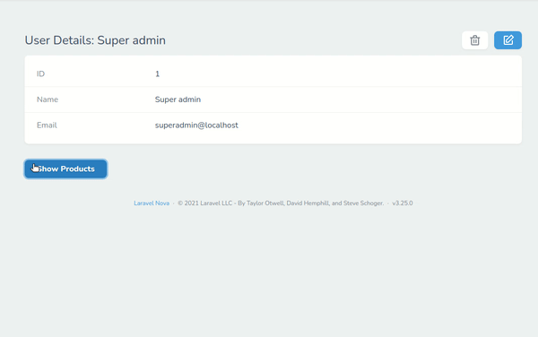

# Laravel Nova Collapsible Field

[](LICENSE)

## Description
This field give the ability to hide/show relationships tables in a resource.

## Screenshots


## Installation
This package can be installed through Composer.

```bash
composer require diezg/collapsible
```

## Example Usage
Fields supported: HasMany*Collapsible*, HasManyThrough*Collapsible*, MorphMany*Collapsible*, MorphToMany*Collapsible*.
```php
use Diezg\Collapsible\HasManyCollapsible;

class User extends Resource
{
    /**
     * Get the fields displayed by the resource.
     *
     * @param  \Illuminate\Http\Request  $request
     * @return array
     */
    public function fields(Request $request)
    {
        return [
            ID::make()->sortable(),

            Text::make('Name'),

            HasManyCollapsible::make(__('Products'), 'products', Product::class)
                ->buttonText('Show custom text', 'Hide custom text'), // Optional
        ];
    }
}

```
